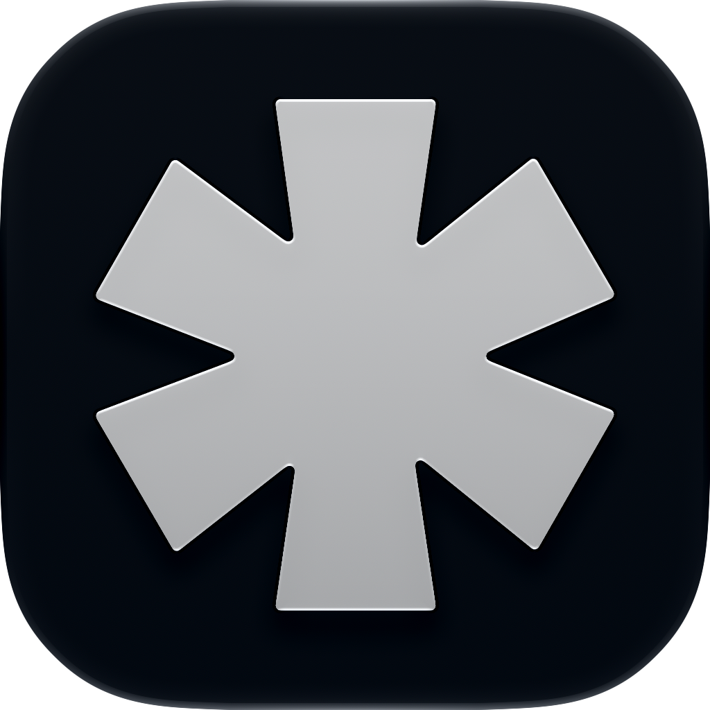

<div align="center">



# Manather

**The native macOS library for vibe-coders.**
Collect references, skills, MCP servers, snippets, and prompts — then export any project as a ready-to-use context pack for your AI agent.

[](https://www.apple.com/macos/)
[](https://swift.org)
[](https://developer.apple.com/xcode/swiftui/)
[](LICENSE)

</div>

---

## What is Manather?

Vibe-coders build projects by feeding AI agents the right context: design references, reusable
skills, MCP server configs, code snippets, reference links, and carefully tuned prompts. Today that
context lives scattered across folders, screenshots, and chat history.

**Manather is one home for all of it.** Drop in everything you want your AI to know about a project,
organize it visually, and when you're ready — **export the whole project as a "context pack"**: a
clean folder with the asset files, a generated `CONTEXT.md`, and a `manifest.json`. Drop that folder
into a repo, point Claude Code (or any agent) at it, and let it build.

> Manather borrows its visual language from GatherOS, but it's a different product: a **build-context
> manager for AI-assisted development**, not a design-reference gallery.

---

## Features

### 📚 A library for every building block
- **Images, GIFs, video** — visual references, design screenshots, background clips
- **Web links** — bookmarks with auto-generated page screenshots (headless `WKWebView`)
- **Code snippets** — syntax-labeled, reusable patterns
- **MCP servers** — launch command + JSON config, so you never lose a server setup
- **Skills** — markdown instructions for AI agents (Claude Code skills and similar)

### 🎨 Find things fast
- **Pinterest-style masonry grid** with a live 2–6 column slider
- **Color filter** — 7 base colors; dominant palettes are extracted on import and matched by hue
- **Search** across titles, prompts, notes, tags, and code
- **Sort** by recency or name

### 🗂 Organize into Projects
- Group any asset into a **Collection** or a **Project**
- Tag freely, with one-click **Auto-tag**
- Store an **AI prompt** and free-form **notes** on every asset

### 📦 Export Context Pack — the killer feature
Right-click any project → **Export Context Pack**. Manather writes:
```
my-project-context-pack/
├── CONTEXT.md          # LLM-readable brief: skills, MCP servers, snippets, links, references
├── manifest.json       # machine-readable index of every asset
├── assets/             # copied image / video files
├── skills/             # each skill as a .md file
└── snippets/           # each snippet in its native extension
```
Hand the folder to an AI agent and it has everything it needs to start.

### 🖼 Detail view
A full-screen viewer with pinch-to-zoom, keyboard navigation, a glassmorphic inspector, and a
live color palette you can copy to the clipboard.

---

## Screenshots

> _Coming soon._ Clone, build, and run locally to see it in action (~30s in Xcode).

---

## Getting Started

**Requirements:** macOS 14 (Sonoma) or later, Xcode 16+.

```bash
git clone https://github.com/Manath-iq/Manather.git
cd Manather
open manather.xcodeproj
```

Press **⌘R** in Xcode to build and run. No external dependencies — everything is built on Apple
frameworks (SwiftUI, SwiftData, ImageIO, AVFoundation, WebKit).

---

## Tech Stack

| Layer | Technology |
|---|---|
| UI | SwiftUI + AppKit bridges |
| Data | SwiftData (local-first, sandboxed) |
| Masonry layout | Custom column distribution |
| Thumbnails | ImageIO / CoreGraphics with an `NSCache` tier |
| Color extraction | CoreGraphics bitmap sampling + hue bucketing |
| Web previews | Headless `WKWebView` |
| Storage | `~/Library/Application Support/ManatherAssets/` |

Files are copied into the app's container; the database stores only relative paths — no memory bloat,
no broken links when originals move.

---

## Roadmap

**MVP (now)**
- [x] Multi-type library: images, video, GIFs, links, snippets
- [x] Skills & MCP server types
- [x] Color filter, search, sort
- [x] Projects + Context Pack export
- [ ] App icon polish & screenshots

**Next**
- [ ] Many-to-many: one asset across multiple projects
- [ ] Canvas board inside a project (moodboard)
- [ ] AI provider: prompt-based image variations, vision auto-tagging, AI-written `CONTEXT.md`
- [ ] Auto-import skills / MCP configs from `~/.claude/`
- [ ] Project templates (preloaded packs)
- [ ] Export straight into a git repo

See [`CLAUDE.md`](CLAUDE.md) for the full product spec.

---

## Contributing

This is an early-stage MVP and ideas are welcome. Open an issue to discuss a feature, or send a PR.

## License

[MIT](LICENSE) © [Manath-iq](https://github.com/Manath-iq)
