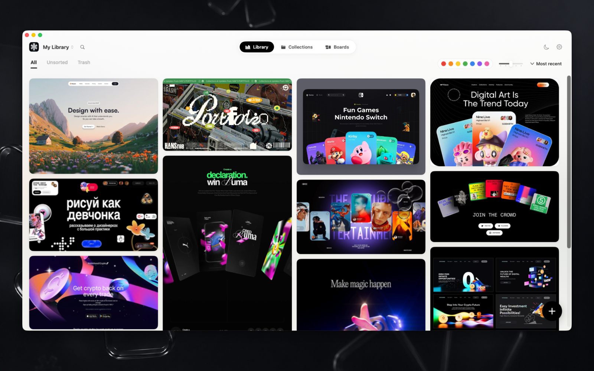
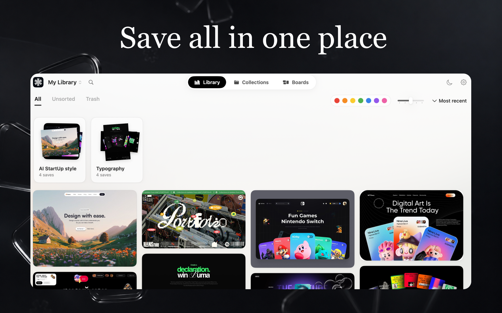
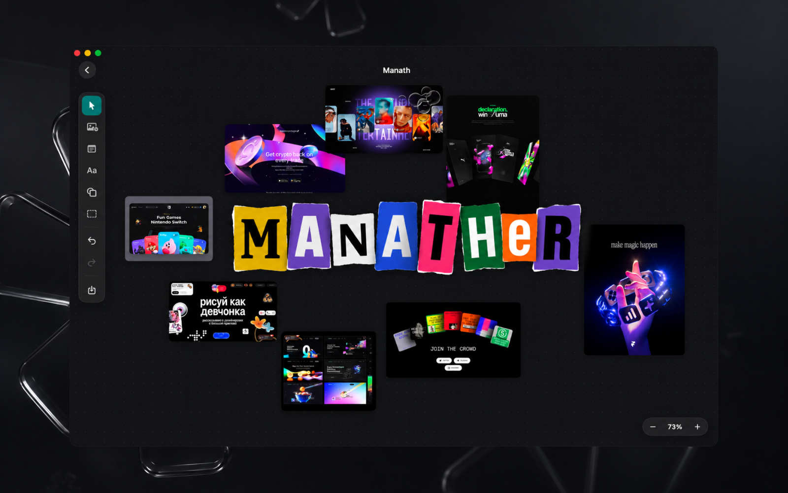
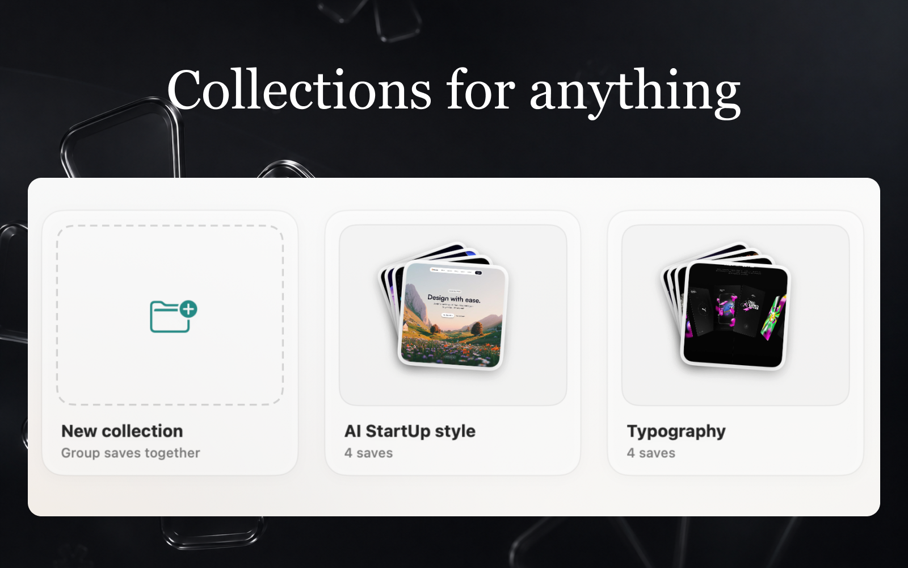

<div align="center">


# Manather

### The native macOS home for everything you feed your AI.

Collect references, skills, MCP servers, snippets, and prompts —
then export any project as a ready-to-use **context pack** for your AI agent.

[](https://www.apple.com/macos/)
[](https://github.com/Manath-iq/Manather/releases/latest)
[](https://github.com/Manath-iq/Manather/releases)
[](https://github.com/Manath-iq/Manather/actions/workflows/build.yml)
[](LICENSE)

<br/>

<a href="https://github.com/Manath-iq/Manather/releases/latest">
  
</a>

<br/>

<a href="https://github.com/Manath-iq/Manather/releases">
  
</a>

<br/>

<sub>Apple Silicon · macOS 14+ · free & open source — or [build from source](#build-from-source)</sub>

<br/><br/>



</div>

---

## Why Manather?

Vibe-coders build by feeding AI agents the right **context**: design references, reusable skills,
MCP server configs, code snippets, reference links, and carefully tuned prompts.

Today that context is scattered — across Finder folders, random screenshots, Notes, and chat history.
When you start a new project you rebuild it from scratch.

**Manather is one home for all of it.** Save your building blocks once, organize them visually, and
when you're ready, hand a whole project to your agent as a single clean folder it can read.

---

## How it works

<table>
<tr>
<td width="33%" valign="top">

### 1 · Collect
Drag in images, links, snippets, skills, MCP configs. Each asset can carry an **AI prompt**,
**notes**, and **tags**.

</td>
<td width="33%" valign="top">

### 2 · Organize
Group assets into **Collections**. Find anything fast with **color filters**,
**search**, and a Pinterest-style grid.

</td>
<td width="33%" valign="top">

### 3 · Export
Right-click a collection → **Export Context Pack**. Drop the folder in a repo and point Claude Code
(or any agent) at it.

</td>
</tr>
</table>

A context pack is a clean, agent-ready folder:

```text
my-project-context-pack/
├── CONTEXT.md      # LLM-readable brief: skills, MCP servers, snippets, links, references
├── manifest.json   # machine-readable index of every asset
├── assets/         # copied image / video files
├── skills/         # each skill as a .md file
└── snippets/       # each snippet in its native extension
```

---

## Features

**🧰 A library for every building block**

| Type | What it stores |
|---|---|
| 🖼 **Images · GIF · video** | visual references, design screenshots, background clips |
| 🔗 **Web links** | bookmarks with an auto-generated page screenshot |
| 💻 **Code snippets** | reusable, syntax-labeled patterns |
| 🔌 **MCP servers** | launch command + JSON config, so a setup is never lost |
| 🧩 **Skills** | markdown instructions for AI agents (Claude Code skills & similar) |
| ✍️ **Prompts** | stored right on any asset, copy with one click |

**🎨 Find things fast** — masonry grid with a 2–6 column slider · color filter (7 hues, auto-extracted
on import) · search across titles, prompts, notes, tags & code · sort by recency or name.

**🧲 Boards — a moodboard canvas** — infinite dot-grid with smooth pan & zoom · drop in library
images plus notes, text, shapes, frames & arrows · **move, resize, and rotate** any object · arrows
draw in any direction · long notes scroll in place · export the board as a **PNG**.

**🖼 Detail view** — full-screen viewer with zoom, keyboard navigation, a glassmorphic inspector, and
a live color palette you can copy to the clipboard.

**⌨️ Native niceties** — styled dark right-click menu · zoom the whole UI (**⌘+ / ⌘− / ⌘0**) · light &
dark themes · search (**⌘F**) and quick tab switching · fluid, consistent motion throughout.

---

## Screenshots

<table>
  <tr>
    <td width="50%"></td>
    <td width="50%"></td>
  </tr>
  <tr>
    <td align="center"><b>Library</b> — masonry grid, color filter, search</td>
    <td align="center"><b>Boards</b> — moodboard canvas</td>
  </tr>
  <tr>
    <td colspan="2"></td>
  </tr>
  <tr>
    <td colspan="2" align="center"><b>Collections</b> — group saves together</td>
  </tr>
</table>

---

## Install

**[⬇ Download the latest `.dmg`](https://github.com/Manath-iq/Manather/releases/latest)** — built for Apple Silicon.

1. Open the `.dmg` and drag **Manather** into your **Applications** folder.
2. First launch: the app isn't notarized by Apple yet, so macOS shows a warning.
   Right-click **Manather → Open → Open**, or allow it under
   **System Settings → Privacy & Security → Open Anyway**.

> Your data stays on your Mac. Files are copied into the app's sandbox; nothing is uploaded anywhere.

---

## Build from source

**Requirements:** macOS 14 (Sonoma)+, Xcode 16+. No external dependencies — pure Apple frameworks.

```bash
git clone https://github.com/Manath-iq/Manather.git
cd Manather
open manather.xcodeproj
```

Press **⌘R** in Xcode to build and run.

---

## Under the hood

| Layer | Technology |
|---|---|
| UI | SwiftUI + AppKit bridges |
| Data | SwiftData (local-first, sandboxed) |
| Masonry layout | Custom column distribution |
| Thumbnails | ImageIO / CoreGraphics with an `NSCache` tier |
| Color extraction | CoreGraphics bitmap sampling + hue bucketing |
| Web previews | Headless `WKWebView` |
| Storage | `~/Library/Application Support/ManatherAssets/` |

The database stores only **relative paths**, so moving originals never breaks a link and memory stays light.

---

## Roadmap

**Shipped**
- [x] Multi-type library: images, video, GIFs, links, snippets, skills, MCP servers
- [x] Color filter, search, sort
- [x] Collections + **Context Pack** export
- [x] **Boards** moodboard canvas — move / resize / rotate, arrows, PNG export
- [x] Continuous integration + one-click `.dmg` releases

**Next**
- [ ] Many-to-many: one asset across multiple collections
- [ ] AI provider: prompt-based image variations, vision auto-tagging, AI-written `CONTEXT.md`
- [ ] Auto-import skills / MCP configs from `~/.claude/`
- [ ] Project templates (preloaded packs)
- [ ] Export straight into a git repo

---

## Contributing

Early-stage and ideas are welcome. Open an issue to
[report a bug](https://github.com/Manath-iq/Manather/issues/new?template=bug_report.yml) or
[request a feature](https://github.com/Manath-iq/Manather/issues/new?template=feature_request.yml),
or send a PR — every push is built by CI, so you'll know instantly if it compiles.

See **[CONTRIBUTING.md](.github/CONTRIBUTING.md)** to get started, and the
**[CHANGELOG](CHANGELOG.md)** for what's new in each release. By participating you agree to
our **[Code of Conduct](CODE_OF_CONDUCT.md)**.

## License

[MIT](LICENSE) © [Manath-iq](https://github.com/Manath-iq)
